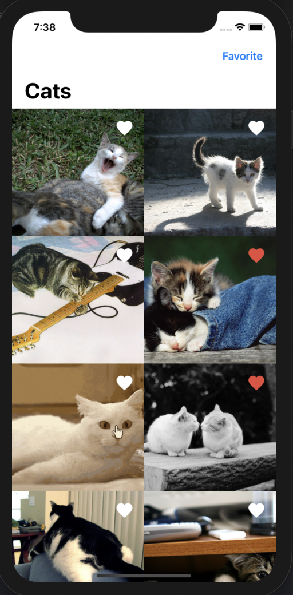

# CatsPicApp
Displays random cat pictures and offers the possibility to favour/un-favour a picture, It follows MVVM software design pattern.

## Requirements
* Xcode 12.3+
* Swift 5+
* iOS 14.3+
## Technical Considerations
- Will use Core Data to handle caching data.
- Will use UrlSession to handle networking.
- Will use uicollectionview prefetchdatasource for handling pagination.
- Unit Tests with code coverage 70%.
- KingFisher is used to cache images both in memory and on disk.
- SwiftLint for code styling.
- I tried to make it simple and don't use a lot of technical enhancement like observation, coordinator, third library, complex UI, and etc.
## Used Libraries
- KingFisher
## Screenshots
 

